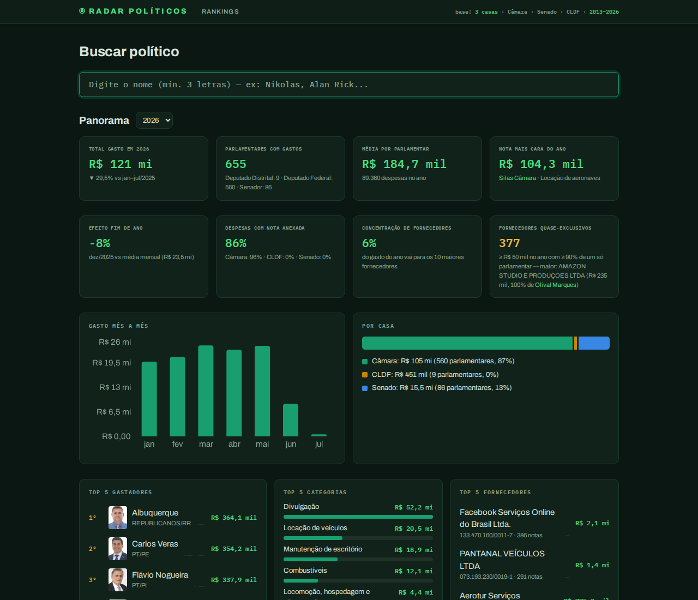
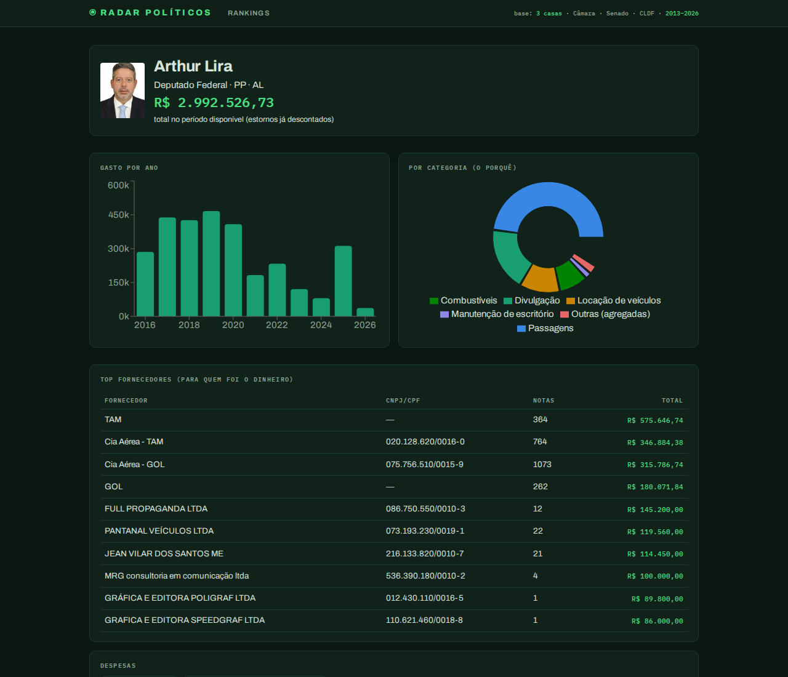

# ⦿ Radar Políticos

**Gastos parlamentares brasileiros, abertos e navegáveis.** O que cada deputado federal, senador e deputado distrital gastou com a verba pública: **o quê, por quê, com quem, quanto e quando** — com o link da nota fiscal quando a fonte publica.

- **Câmara dos Deputados** — CEAP (Cota para Exercício da Atividade Parlamentar), 2016–2026
- **Senado Federal** — CEAPS, 2016–2026
- **Câmara Legislativa do DF** — verbas indenizatórias, 2013–2026

**2,9 milhões de despesas · 1.547 políticos · 3 casas legislativas** — tudo de fontes oficiais, validado ao centavo contra os arquivos públicos, publicado como **site 100% estático** (nenhum servidor em produção).



## O que dá para ver

- **Busca por político** → perfil com total gasto, evolução ano a ano, gastos por categoria, top fornecedores e a **tabela completa de despesas com link para cada nota fiscal**
- **Panorama do ano**: total, média por parlamentar, nota mais cara, **efeito fim de ano** (dezembro vs média mensal), **transparência documental** por casa, **concentração de fornecedores** e **fornecedores de cliente único** (≥ R$ 50 mil com ≥ 90% de um único gabinete — recorte estatístico comum e legal na cota, que dispensa licitação)
- **Estatísticas**: média e **mediana** de gasto por partido (média longe da mediana = gastador extremo), média por estado e por casa
- **Rankings** de maiores gastadores por ano e por cargo



## Arquitetura

```
┌── INGESTÃO (local ou CI) ─────────────────────────────────────┐
│ python -m radar.ingest      baixa os arquivos oficiais        │
│   fontes/camara.py          CSV anual da CEAP                 │
│   fontes/senado.py          CSV anual da CEAPS                │
│   fontes/cldf.py            XLSX do portal CKAN da CLDF       │
│         → normaliza para um modelo único → dados/radar.duckdb │
└───────────────────────────────┬───────────────────────────────┘
                                ▼
│ python -m radar.exportar    gera JSONs estáticos              │
│         → frontend/public/dados/ (perfis, panoramas,          │
│           rankings por cargo, despesas compactas por político)│
                                ▼
│ next build (output: export) → frontend/out/                   │
│   1.547 páginas pré-renderizadas com title/description/OG     │
│   únicos por político + sitemap.xml — SEO sem servidor        │
└───────────────────────────────────────────────────────────────┘
```

Decisões principais:

- **DuckDB** local como banco analítico (agregações sobre 2,9 M de linhas em milissegundos)
- **Modelo único de despesa** entre as fontes: adicionar uma nova casa legislativa = escrever um módulo `fontes/*.py` com `baixar()` + `parse()`, sem tocar no resto
- **Site estático** (Next.js `output: 'export'`): custo de hospedagem zero, atualização = rodar ingestão + export + build e republicar
- A API FastAPI (`radar/api`) existe **apenas para desenvolvimento local** — o site não depende dela; a paridade entre API e export é garantida por `radar/consultas.py` compartilhado e testada

## Como rodar

Pré-requisitos: Python 3.12 + [uv](https://docs.astral.sh/uv/), Node 20+.

```bash
# 0. dependências
cd backend && uv sync && cd ../frontend && npm install && cd ..

# 1. ingestão dos dados oficiais (re-executável e idempotente; ~10 min na primeira vez)
cd backend
uv run python -m radar.ingest --anos 2016-2026 --db ../dados/radar.duckdb --pasta ../dados
uv run python -m radar.ingest --anos 2013-2026 --fontes cldf --db ../dados/radar.duckdb --pasta ../dados

# 2. exportar os JSONs estáticos (~570 MB em frontend/public/dados)
uv run python -m radar.exportar --db ../dados/radar.duckdb --saida ../frontend/public/dados

# 3. build do site (gera frontend/out/)
cd ../frontend && npm run build

# 4. ver localmente
npx serve out
```

Para desenvolvimento com hot-reload: `npm run dev` (usa os mesmos `public/dados`). API local opcional para debug: `cd backend && uv run uvicorn radar.api.app:app_padrao --factory --port 8010`.

## Publicar

**A ingestão precisa rodar de um IP brasileiro** — Câmara e Senado bloqueiam IPs de datacenter estrangeiro no nível de rede (verificado: timeout de conexão nos runners do GitHub; só a CLDF responde). Por isso a publicação é um comando local:

```bash
./publicar.sh   # ingestão → export → testes → build → deploy no Pages
```

O CI ([`.github/workflows/ci.yml`](.github/workflows/ci.yml)) roda os testes de backend e frontend em todo push/PR — nada é publicado pelo CI.

## Publicar manualmente (passo a passo)

`frontend/out/` funciona em qualquer hosting estático:

- **Cloudflare Pages** (domínio padrão `radar-politicos.pages.dev`):
  ```bash
  npx wrangler login                                        # uma vez
  npx wrangler pages deploy frontend/out --project-name radar-politicos
  ```
  Limite de 20 mil arquivos por deploy; o site usa ~17 mil. O primeiro upload (~660 MB) demora; os seguintes enviam só o que mudou.
- **GitHub Pages / Netlify**: publique o diretório (atenção: os caminhos de dados são absolutos — o site precisa estar na raiz do domínio)

A URL pública fica em um único lugar: `frontend/src/lib/site.ts` (usada em `metadataBase`, sitemap e robots). Ao trocar de domínio, ajuste lá e rebuilde.

## Qualidade e validação

- **125 testes automatizados** (64 backend + 8 frontend + suítes de fontes) com TDD; ingestão atômica por (fonte, ano) com rollback
- **Validação contra as fontes oficiais**: totais re-somados de forma independente batem **ao centavo** — relatórios em [`docs/superpowers/validacao-2026-07-10.md`](docs/superpowers/validacao-2026-07-10.md) e [`validacao-cldf-2026-07-12.md`](docs/superpowers/validacao-cldf-2026-07-12.md), incluindo as inconsistências **dos próprios dados oficiais** que ingerimos fielmente e documentamos (linha duplicada na CLDF/2018, divergência CSV×API da Câmara por passagens SIGEPA, arquivos incompletos na origem)
- **Acessibilidade dos gráficos**: todas as paletas passam por verificador de daltonismo (CVD) e contraste — nada de cor no olho
- Designs, planos e decisões documentados em [`docs/superpowers/`](docs/superpowers/)

## Limitações conhecidas (herdadas das fontes)

- Senado e CLDF **não publicam** o link da nota fiscal (só a Câmara: ~96% das despesas com comprovante)
- CLDF 2025+ publica apenas totais mensais por categoria (sem fornecedor/data); ~13,5 mil despesas antigas vêm sem categoria na origem
- Verbas de gabinete de câmaras municipais e governos estaduais **não têm dados abertos estruturados** (levantamento de 26 capitais + 27 estados em `docs/superpowers/specs/2026-07-12-fonte-cldf-design.md`) — apenas a CLDF era viável

## Neutralidade

**O Radar Políticos não tem vínculo nem viés político-partidário.** Todos os dados vêm das bases abertas oficiais e são apresentados como publicados, sem edição. Indicadores como "fornecedores de cliente único" são recortes estatísticos de um regime que dispensa licitação — não são acusações nem indícios de irregularidade. O objetivo é dar ao cidadão acesso claro à informação que já é pública.
